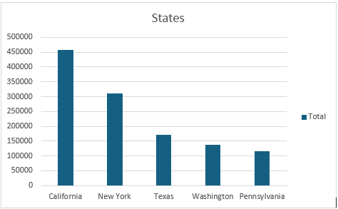

# Myntra Dataset Analysis [Excel]

## Objective

The project aimed to clean and validate Myntra's catalogue data using Excel to ensure accuracy and completeness, enabling reliable analysis for identifying sales trends and optimizing inventory management.

Create Folllowing Reports:

- Segment Report
- Order Report

## Excel Operations
Excel is used to explore and visulize data for small datasets.
| Functions  |  Purpose  |
|------------|-----------|
|Conditional Formatting| Identifing Duplicate Values |
|Pivot Table | Visulizing the whole dataset in a table|
|Charts & Graphs | Visulizing the whole dataset in a table |

## Development
- What's the general approach in creating this solution from start to finish?
	1. Get Excel data
	2. Explore the data in Excel
	3. Clean the data with Excel
	4. Generate the findings based on the insights
	
## Segment Report

- What are the total number of rows and columns in the dataset?

|Columns| 23 |
|-------|----|
|Rows	|9995 |

- What are the different customer segments present in the dataset?

|Row Labels |
|-----------|
Consumer
Corporate
Home Office

- How do sales, profit, and quantity vary across different segments?

Segments

|Row Labels	 | Sum of Sales	| Sum of Profit	| Sum of Quantity |
|----------|----------|-----------|-----------|
Consumer| 	1161401 |	134119 |	19521|
Corporate	|706146	|91979	|11608|
Home Office	|429653|	60298|	6744|
Grand Total|	2297200|	286397|	37873|

			
Sales segments
|Row Labels	| Sum of Sales |
|-----------|--------------|
Consumer	|1161401 |
Corporate	|706146	
Home Office	|429653|

Profit segments

|Row Labels|	Sum of Profit|
|----------|----------------|
|Consumer|	134119|
|Corporate|	91979|
|Home Office|	60299|

Quantity segments

|Row Labels	| Sum of Quantity|
|---------|------------------|
|Consumer	|19521
|Corporate	| 11608
|Home Office |	6744

- What are the top States, and cities by sales volume?

States 

|Row Labels	|Sum of Sales|
|-----------|--------|
|California	|457687|
|New York	| 310876|
|Texas	| 170188|
|Washington	| 138641 |
|Pennsylvania| 116511|
|Grand Total|1193905|

City
	
|Row Labels	|Sum of Sales|
|---------|-----------|
|New York City|	256368|
|Los Angeles	|175851|
|Seattle	|119540|
|San Francisco|	112669|
|Philadelphia	|109077|
|Grand Total	|773506|

- Is there any regional variation in terms of product categories or sub-categories?

|Row Labels	|West	|East	|Central	|South	|Grand Total|
|------------|---------|---------|---------|---------|---|
|Furniture|	707	|601	|481	|332|	2121|
|Office Supplies|	1897|	1712|	1422|	995|	6026|
|Technology	|599|	535	|420|	293	|1847|
|Grand Total|	3203|	2848|	2323|	1620|	9994|

## Ordere Report

- What is the Average Order value AOV by customer segment and product category?

|Row Labels	|Furniture	|Office Supplies	Technology	|Grand Total|
|------|------|-------|-------|
|Consumer	|351|116	|427|	224|
|Corporate	|355|	127|	445	|234|
|Home Office|	337	|115|	536	|241|
|Grand Total|350|	119	|453	|230|

|Furniture|	average sales|       
|--------|----------|
|Consumer	|351|
|Corporate	|355|
|Home Office |	337|

|Office Supplies|	average sales|
|------|------|
|Consumer	|116|
|Corporate	|127|
|Home Office|	115|

|Technology	|average sales|
|---------|-----------|
|Consumer	|427|
|Corporate	|445|
|Home Office|	536|

